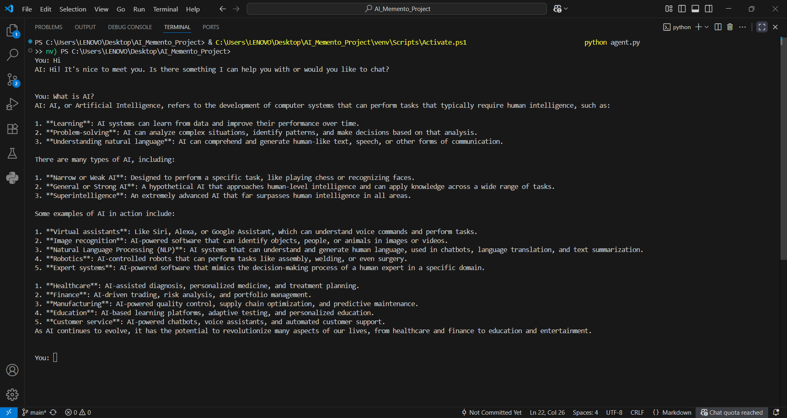
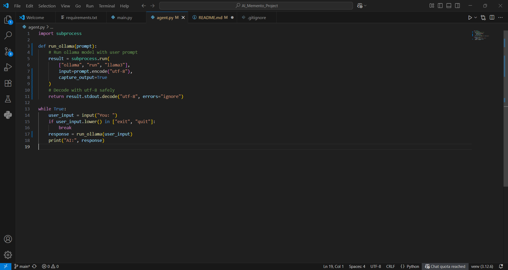

## 🖼 Demo

Here is the AI in action:

Here is the main code snippet:

# 🤖 AI Memento Project

AI Memento Project is a simple AI agent built using **Python** and **Ollama (Llama 3 model)**.  
It allows you to chat with an AI locally on your system.  

## 🚀 Features
- Short answers (interview-style)  
- Long answers (teacher-style)  
- Runs on your computer using Ollama  

## ⚙️ How to Run
1. Install [Ollama](https://ollama.com/download)  
2. Download the model:  
